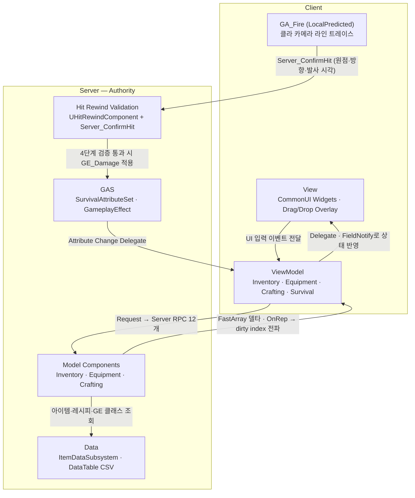

# Project EXFIL

#### 타르코프 스타일 그리드 인벤토리와 서버 히트 리와인드 검증 슈팅을 </br>UE 5.6 C++ Dedicated Server 아키텍처로 구현한 멀티플레이어 서바이벌 시스템 프로토타입

<!-- 대표 미디어 판정: 다중 클라이언트 조작·UI 상호작용이 보여야 이해되는 프로젝트 → mp4가 적합하나
     GitHub user-attachments mp4가 없어 기존 README의 실재 시연 영상(YouTube)을 썸네일 링크로 사용. — 확인 필요 #2 -->

[](https://youtu.be/YY7HUjYSVkw)

<sub>썸네일을 클릭하면 시연 영상을 시청할 수 있습니다.</sub>


## Contents

| # | 섹션 | 내용 |
|---|---|---|
| 1 | [Overview](#1-overview) | UE 5.6 · GAS · MVVM 스택과 담당 범위 |
| 2 | [Architecture](#2-architecture) | Client / Server 권한 경계와 데이터 흐름 |
| 3 | [Key Features](#3-key-features) | 그리드 인벤토리 · 히트 리와인드 · GAS · 리플리케이션 |
| 4 | [Performance](#4-performance) | 비트맵 탐색 5.38x 개선 측정 기록과 조건 |
| 5 | [Getting Started](#5-getting-started) | 빌드 요구사항과 개발 환경 세팅 |
| 6 | [Documentation](#6-documentation) | 벤치마크 · 자동화 테스트 · 아키텍처 문서 |


## 1. Overview

| Category | Description                                                                                                                                    |
|---|------------------------------------------------------------------------------------------------------------------------------------------------|
| Engine | Unreal Engine 5.6 (Launcher 배포판)                                                                                                               |
| Language | C++ (게임플레이 로직 전부 C++ · 에셋 조립과 UMG 레이아웃은 에디터/BP)                                                                                                |
| Core Tech | <ul><li>Dedicated Server 리플리케이션 (FastArraySerializer)</li><li>GAS (GameplayAbilities)</li><li>MVVM (CommonUI + ModelViewViewModel)</li></ul> |
| Genre / Type | 멀티플레이어 서바이벌(익스트랙션 슈터) 시스템 프로토타입                                                                                                                |
| Period | 2026.03.18 – 2026.05.26 (실 개발 : 27일)                                                                                                           |
| Team | Solo                                                                                                                                           |

**My Role**

| 담당 영역 | 구현 범위 |
|---|---|
| Inventory | <ul><li>10×20 그리드 배치 알고리즘</li><li>RowBitmap O(H) 빈 슬롯 탐색</li><li>FastArray 델타 캐시 부분 패치</li><li>스택 병합·회전·드래그앤드롭</li></ul> |
| Hit Rewind Validation | <ul><li>UHitRewindComponent (30Hz 캡슐 히스토리)</li><li>Server_ConfirmHit 4단계 재검증 (원점·리와인드 캡슐 교차·조준각·LOS)</li></ul> |
| GAS | <ul><li>SurvivalAttributeSet 8속성</li><li>2단계 클램핑</li><li>GA_Fire</li><li>장비/소모품 GameplayEffect 파이프라인</li></ul> |
| Model Components | <ul><li>EquipmentComponent (6슬롯)</li><li>CraftingComponent (서버 타이머·원자적 재료 소모)</li><li>ItemDataSubsystem (DataTable + 지연 로드 캐시)</li></ul> |
| ViewModel · View | <ul><li>Inventory/Equipment/Crafting/Survival ViewModel</li><li>CommonUI 위젯</li><li>멀티셀 아이콘 오버레이</li><li>Dirty Index 부분 갱신</li></ul> |

<!-- Solo 프로젝트 (전 커밋 동일 인물 — git identity 2개: 강수현 <rkdtngus3579@gmail.com> 82커밋,
     suhyun <86099781+agnesAqr@users.noreply.github.com> 2커밋, 동일 GitHub 계정 agnesAqr) — My Commits 링크 생략 -->


## 2. Architecture

모든 게임 상태는 Dedicated Server가 확정하고, 클라이언트는 요청과 예측 표시만 담당하는 Server Authority 구조입니다.



**설계 원칙**

- Server Authority
  - 모든 게임 로직은 서버에서만 실행, 클라이언트는 Request → Server RPC → `_Internal` 3계층으로 요청만 전달
- MVVM 단방향
  - Model 변경은 Delegate / OnRep / FieldNotify로만 전파, Tick/Timer 기반 Model polling 금지
- Data-Driven
  - 아이템·레시피·장비 스펙은 DataTable CSV, 텍스처·GE 클래스는 TSoftObjectPtr / TSoftClassPtr 지연 로드 후 Subsystem 캐시

**권한 경계**

- 클라이언트는 발사 라인 트레이스와 인벤토리 배치 가능 하이라이트(`bPredictedPlaceable`)만 예측하고, 히트·배치·소모는 전부 서버가 확정
- 확정 상태는 FastArray `NetDeltaSerialize`와 OnRep으로 전파 — Inventory/Equipment/Crafting/개인 스탯은 `COND_OwnerOnly`, Health·WorldItem·RespawnPhase는 `COND_None`
- 피격 연출은 `Multicast_PlayHitReact` (Unreliable) 단일 경로로만 출력

[아키텍처 다이어그램 →](docs/Portfolio)


## 3. Key Features

### 3.1 그리드 인벤토리 비트맵 탐색

<sub>Architecture · **Inventory**</sub>

| 소스 | 역할 |
|---|---|
| [`InventoryComponent.h`](Source/Project_EXFIL/Inventory/InventoryComponent.h) · [`.cpp`](Source/Project_EXFIL/Inventory/InventoryComponent.cpp) | 그리드 배치·회전·스택 병합, RowBitmap 빈 슬롯 탐색, `FInventoryFastArray` 복제 타입 정의 |
| [`EXFILInventoryTypes.h`](Source/Project_EXFIL/Inventory/EXFILInventoryTypes.h) | `FInventoryItemInstance` 아이템 엔트리와 `FItemSize` / `FInventorySlot` 정의 |
| [`InventoryBitmapBenchmark.cpp`](Source/Project_EXFIL/Tests/Benchmarks/Inventory/InventoryBitmapBenchmark.cpp) | Before/After 성능 비교 벤치마크 (4. Performance 근거) |


- 1D `TArray`로 2D 그리드(기본 10×20)를 표현 — 멀티셀 아이템 배치, R 키 회전, 스택 병합, 드래그앤드롭
- `RowBitmap (TArray<uint16>)` 비트마스크 AND 검사로 빈 영역 검증을 O(H)로 축소, `ItemIndexMap` / `ItemCountCache`로 인스턴스·수량 조회를 상수 시간화
- Replicated 데이터(`FInventoryFastArray`)와 로컬 캐시(GridSlots·TMap·Bitmap)를 분리하고, FastArray 콜백에서 변경분만 부분 패치

### 3.2 서버 히트 리와인드 검증 슈팅

<sub>Architecture · **Hit Rewind Validation**</sub>

| 소스 | 역할 |
|---|---|
| [`HitRewindComponent.h`](Source/Project_EXFIL/Core/HitRewindComponent.h) · [`.cpp`](Source/Project_EXFIL/Core/HitRewindComponent.cpp) | 30Hz 캡슐 히스토리 기록, 0.2초 범위 리와인드 보간 |
| [`EXFILCharacter.h`](Source/Project_EXFIL/Core/EXFILCharacter.h) · [`.cpp`](Source/Project_EXFIL/Core/EXFILCharacter.cpp) | `Server_ConfirmHit` 4단계 재검증 (원점·리와인드 캡슐 교차·조준각·LOS) |
| [`GA_Fire.h`](Source/Project_EXFIL/GAS/GA_Fire.h) · [`.cpp`](Source/Project_EXFIL/GAS/GA_Fire.cpp) | 클라이언트 라인 트레이스 후 서버 확인 요청 |


- `GA_Fire` (LocalPredicted · InstancedPerActor) — 클라이언트가 카메라 기준 라인 트레이스 후 `Server_ConfirmHit(HitActor, TraceStart, TraceDirection, FireServerTime)` 호출
- 서버 4단계 재검증:
  1. **원점 sanity** — 클라가 주장한 `TraceStart`와 서버가 아는 pawn 시점 위치 거리 검사 (기본 600cm 초과 시 거부)
  2. **리와인드 캡슐 교차** — `UHitRewindComponent`가 30Hz로 기록한 히스토리를 `FireServerTime`(0.2초 window로 clamp)으로 보간해 과거 캡슐을 복원하고, 사격 segment와 캡슐 축 segment의 최단거리로 교차 판정. 히스토리가 해당 시각을 덮지 못하면 대상의 **현재 캡슐로 fallback** 후 동일 판정
  3. **조준각** — 서버 control rotation과 전달된 방향의 각도 차 30° 초과 시 거부 (`bRejectOnAimDeviation`, 기본 `true`)
  4. **LOS** — `ECC_Visibility` 라인 트레이스로 차폐 확인
- 1·3·4단계는 실패 시 즉시 히트 거부, 2단계는 교차 실패 시 거부 — 통과 시에만 `GE_Damage` 적용
- 랙 보정(히트 리와인드)은 구현 완료, GAS Prediction Key 발급·롤백은 미구현 (4. Performance 한계 참조)

### 3.3 GAS 서바이벌 파이프라인

<sub>Architecture · **GAS**</sub>

| 소스 | 역할 |
|---|---|
| [`SurvivalAttributeSet.h`](Source/Project_EXFIL/GAS/SurvivalAttributeSet.h) · [`.cpp`](Source/Project_EXFIL/GAS/SurvivalAttributeSet.cpp) | 8속성 정의, 2단계 클램핑, 복제 조건 분리 |
| [`EquipmentComponent.cpp`](Source/Project_EXFIL/Data/Equipment/EquipmentComponent.cpp) | 6슬롯 장비 장착 시 Infinite GE Apply · 해제 시 `RemoveActiveGameplayEffect` |
| [`InventoryComponent.cpp`](Source/Project_EXFIL/Inventory/InventoryComponent.cpp) | 소모품 `ConsumableEffect` Instant GE 적용 |
| [`SurvivalViewModel.h`](Source/Project_EXFIL/GAS/SurvivalViewModel.h) | ASC Attribute Change Delegate를 구독해 `FOnStatChanged`로 UI에 중계 |


- `USurvivalAttributeSet` 8속성 (Health/Hunger/Thirst/Stamina + Max) — `PreAttributeChange`(CurrentValue) + `PostGameplayEffectExecute`(BaseValue) 2단계 클램핑
- 복제 조건을 가시성 기준으로 분리 — Health/MaxHealth는 `COND_None`(타 플레이어 HP 표시), 개인 생존 스탯은 `COND_OwnerOnly`
- 장비 장착 시 Infinite GE Apply / 해제 시 Remove, 소모품은 Instant GE — 6슬롯 장비(Head/Face/Eyewear/Body/Weapon1/Weapon2)와 연동
- `USurvivalViewModel`은 MVVM ViewModel이 아닌 얇은 passthrough `UObject` — `GetGameplayAttributeValueChangeDelegate` 구독 결과를 멀티캐스트 델리게이트로 재방출

### 3.4 Dedicated Server 리플리케이션 전략

<sub>Architecture · **Server Authority**</sub>

| 소스 | 역할 |
|---|---|
| [`InventoryComponent.cpp`](Source/Project_EXFIL/Inventory/InventoryComponent.cpp) | Inventory Server RPC 4종, FastArray `NetDeltaSerialize` 델타 복제 |
| [`CraftingComponent.h`](Source/Project_EXFIL/Crafting/CraftingComponent.h) | 서버 타이머 기반 제작, 원자적 재료 소모·실패 롤백 |
| [`EXFILCharacter.h`](Source/Project_EXFIL/Core/EXFILCharacter.h) · [`.cpp`](Source/Project_EXFIL/Core/EXFILCharacter.cpp) | 사망·리스폰 `ERespawnPhase` OnRep 단일 경로 |
| [`ItemDataSubsystem.h`](Source/Project_EXFIL/Data/ItemDataSubsystem.h) | DataTable 로드와 지연 캐시 |


- Server RPC 12개 (Inventory 4 · Equipment 4 · Crafting 2 · Character 2) — `_Implementation`에서 sanity check 후 early return, 통과분만 `_Internal`에 위임
- 크래프팅은 서버 타이머 기반 결과 지급 + 원자적 재료 소모/실패 시 롤백, 인벤토리는 FastArray `NetDeltaSerialize` 델타 복제
- 사망/리스폰은 `AEXFILCharacter`의 `ERespawnPhase` Replicated enum OnRep 단일 경로로 처리해 late-joiner에도 안전


## 4. Performance

| 항목 | Before | After | 개선 | 근거 |
|---|---|---|---|---|
| `FindFirstAvailableSlot` (10×20 · Fragmented50 · 2×3 아이템) | 31.06ms | 5.77ms | 5.38x (−81.4%) | [측정](docs/Benchmarks/GridInventoryBitmap.md#representative-result) |
| `FindFirstAvailableSlot` 10×20 전체 30케이스 평균 | — | — | 평균 2.96x (최대 5.71x) | [측정](docs/Benchmarks/GridInventoryBitmap.md#summary) |
| `AreSlotsFree` 10×20 전체 30케이스 평균 | — | — | 평균 1.36x (최대 2.73x) | [측정](docs/Benchmarks/GridInventoryBitmap.md#summary) |

**측정 조건**

| 항목 | 값 |
|---|---|
| 측정 도구 | UE Automation Test (Development Editor) |
| 벤치마크 코드 | `Source/Project_EXFIL/Tests/Benchmarks/Inventory/InventoryBitmapBenchmark.cpp` |
| 점유 패턴 | 고정 시드(3579)로 재현 |
| 반복 횟수 | 케이스당 100,000회 |
| 측정 방식 | 워밍업 후 3회 실행 중 최단값 (`FPlatformTime::Seconds()`) |
| 최근 검증일 | 2026-05-19 |

**개선 과정**

| 단계 | 내용 |
|---|---|
| Before | `GridSlots` 셀 스캔 — 후보 좌표마다 아이템 footprint 내부 셀을 재순회, 단편화된 그리드에서 비용 급증 |
| After | `RowBitmap` 비트마스크 — 각 행의 점유 상태를 `uint16`로 압축, 충돌 검사를 행당 AND 1회로 축소 |
| 검증 | Before/After 결과 동일성 확인 후 재측정 → 대표 케이스 5.38x 개선 확인 |
| 예외 | Empty/1×1처럼 첫 후보에서 바로 성공하는 케이스는 개선폭이 작거나 근소하게 느림 (최소 0.97x) |

**한계**

- GAS Prediction 미구현
  - `GA_Fire`는 `LocalPredicted` 정책이지만 실제 Prediction Key 발급·롤백은 없음 (클라 즉시 활성화 + 서버 `ConfirmHit` 재검증 조합으로 대체)
  - 참고: 랙 보정 자체는 `UHitRewindComponent` 기반 서버 히트 리와인드로 별도 구현되어 있어, 위 미구현 사항과는 별개
- Planned 항목
  - 시작 로드아웃 seed 코드(`AEXFILCharacter::BeginPlay`의 하드코딩 ItemID)의 DataTable 분리
  - `ItemDataSubsystem`의 `LoadSynchronous` 최초 로드 → async 전환
  - `TActorIterator` 근접 검색 → spatial query 교체

[상세 측정 기록 →](docs/Benchmarks/GridInventoryBitmap.md)


## 5. Getting Started

**Requirements**

- Unreal Engine 5.6 (Launcher 배포판 · Source Build 불필요)
- Visual Studio 2022 또는 JetBrains Rider
- Windows 11
- 외부 SDK 없음 (사용 플러그인은 전부 엔진 내장: GameplayAbilities · CommonUI · ModelViewViewModel · StateTree · GameplayStateTree)

**Setup**

```bash
git clone https://github.com/agnesAqr/project_EXFIL.git
```

1. `Project_EXFIL.uproject` 우클릭 → Generate Visual Studio project files
2. Development Editor 구성으로 빌드
3. 에디터에서 PIE → Players 2 → Net Mode: Play As Listen Server 또는 Dedicated Server


## 6. Documentation

| 문서 | 내용 |
|---|---|
| [GridInventoryBitmap.md](docs/Benchmarks/GridInventoryBitmap.md) | 인벤토리 비트맵 탐색 벤치마크 — 방법론·시나리오 매트릭스·결과 |
| [GridSearchBenchmarkTest/](docs/Benchmarks/GridSearchBenchmarkTest) | 벤치마크 원본 실행 기록 (일자별) |
| [InventoryAutomationTests.md](docs/Tests/InventoryAutomationTests.md) | 인벤토리 자동화 유닛 테스트 12개 목록 |
