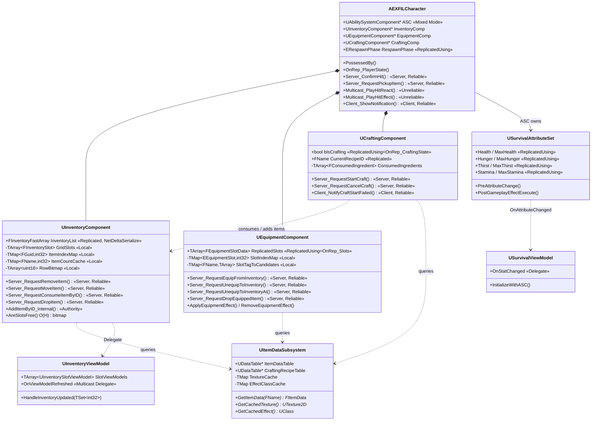
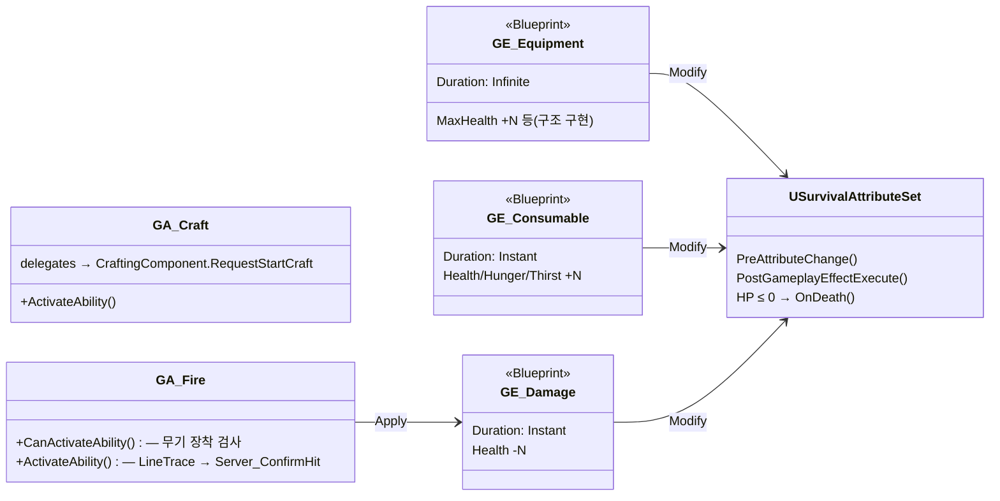
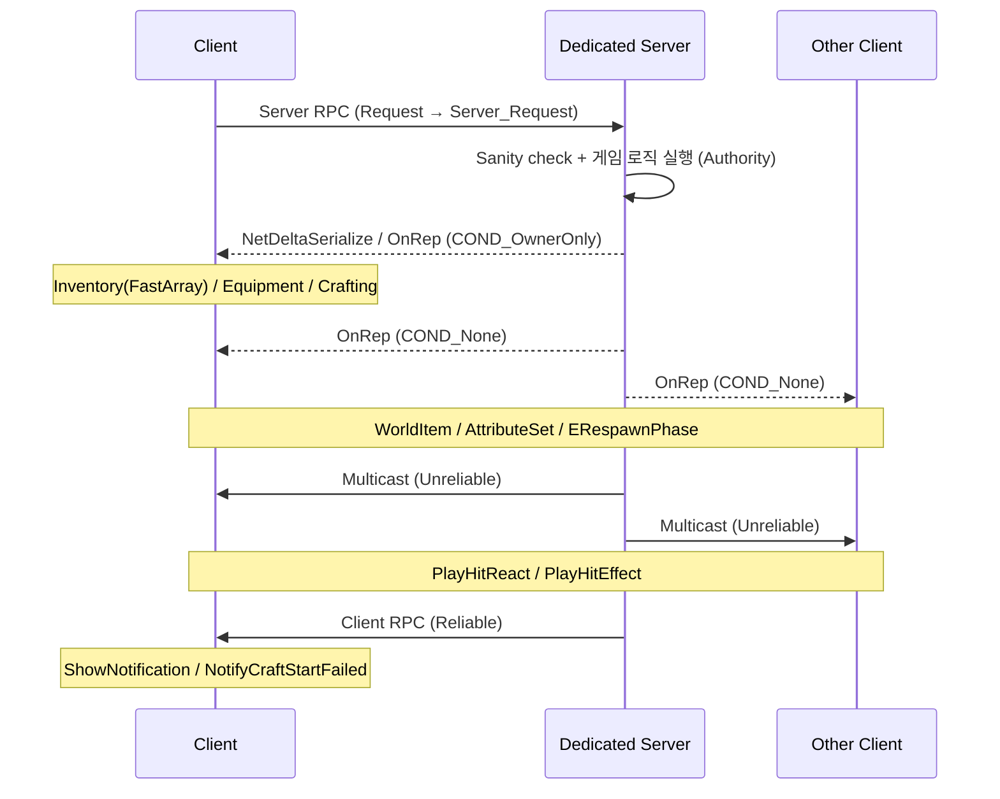

# Project EXFIL

**UE5 C++ Dedicated Server 기반 멀티플레이어 서바이벌 시스템 프로토타입**

타르코프 스타일 그리드 인벤토리, GAS 통합 전투, 크래프팅 시스템을 UE 5.6 C++ Dedicated Server 아키텍처로 구현한 포트폴리오 프로젝트.

---

## 🎬 시연 영상

[](https://youtu.be/OF0snQA3hdw?si=EU7B3wh0OLt1pxQ9)

---

## 📌 개요

| | |
|---|---|
| **엔진** | Unreal Engine 5.6 |
| **언어** | C++ (100%, 블루프린트 미사용) |
| **아키텍처** | Dedicated Server / Server Authority |
| **개발 기간** | 2026.03.18 - 2026.03.29 (8일 스프린트) + 후속 리팩토링 |
| **작업 인원** | 1명 |
| **주요 모듈** | GameplayAbilities · ModelViewViewModel · CommonUI · NetCore |

---

## 📁 프로젝트 구조

```
Source/Project_EXFIL/
├── Core/              캐릭터·게임모드·플레이어컨트롤러·로깅 (4클래스)
├── Inventory/         FastArray 기반 그리드 인벤토리 + 데이터 구조체 (1클래스)
├── GAS/               AttributeSet · GA_Fire · GA_Craft · SurvivalViewModel (4클래스)
├── Crafting/          타이머 기반 크래프팅 컴포넌트 (1클래스)
├── Data/              ItemDataSubsystem + FItemData / FCraftingRecipe
│   └── Equipment/     EquipmentComponent + 장비 슬롯 enum/struct (2클래스)
├── UI/                MVVM 위젯 + 드래그드롭 + UIManager (13클래스)
├── World/             WorldItem 픽업/드롭 액터 (1클래스)
└── Project_EXFILCharacter/GameMode/PlayerController  (Epic 템플릿 베이스)
```

> Core 클래스(`AEXFILCharacter` 등)는 Epic 템플릿 베이스(`AProject_EXFILCharacter` 등)를 상속해 EXFIL 도메인 로직을 확장합니다.

---

## 📊 기술 스택

| 분류 | 기술 |
|------|------|
| 엔진 | UE 5.6 |
| 언어 | C++ |
| GAS | AbilitySystemComponent (Mixed Mode), AttributeSet, GameplayAbility, GameplayEffect |
| 네트워크 | Dedicated Server, Server RPC, OnRep, Multicast, **FFastArraySerializer (NetDeltaSerialize)** |
| UI | CommonUI (UCommonActivatableWidget), **MVVM (ModelViewViewModel · FieldNotify)**, Slate NativePaint |
| 데이터 | UDataTable + CSV, UItemDataSubsystem (GameInstanceSubsystem), TSoftObjectPtr / TSoftClassPtr 지연 로드 |

---

## 🎯 핵심 시스템

| 시스템 | 설명 |
|--------|------|
| **Grid Inventory (10×12)** | 다중 크기 아이템 배치, 회전, 드래그앤드롭, 스택 병합, 비트맵 기반 O(H) 슬롯 검색 |
| **FastArray Replication** | `FInventoryFastArray` + `NetDeltaSerialize`, 변경 인덱스 단위 PostReplicatedAdd/Change/Remove 콜백 |
| **Crafting** | DataTable 레시피 기반, 원자적 재료 소모 + 실패 시 롤백, 타이머 + GA_Craft |
| **Equipment** | 6슬롯 (Head/Face/Eyewear/Body/Weapon1/Weapon2), 장착 시 GE Apply / 해제 시 Remove |
| **Survival Stats** | GAS AttributeSet 8속성 (Health, Hunger, Thirst, Stamina + Max), Pre/Post 클램핑 2단계 |
| **Line Trace Shooting** | LocalPredicted GA_Fire → Server_ConfirmHit (서버 라인 트레이스 재검증) |
| **Death / Respawn** | `ERespawnPhase` Replicated enum (Alive→Dead→HiddenDead→Respawning→Alive), OnRep 단일 경로로 late-joiner 안전 |

---

## 🏗️ 아키텍처

```
View Layer (CommonUI Widgets + Drag/Drop Overlay)
    │  Delegate / FieldNotify
ViewModel Layer (InventoryViewModel · SurvivalViewModel)
    │  Delegate
Model Layer (UInventoryComponent · UCraftingComponent · UEquipmentComponent)
    │
GAS Layer (USurvivalAttributeSet · GA_Fire · GA_Craft · GE_Damage 등)
    │
Data Layer (UItemDataSubsystem · UDataTable · CSV)
    │
Network Layer (FastArray · Server RPC · OnRep · COND 전략 분리)
```

### 설계 원칙

- **MVVM 단방향:** View → ViewModel → Model 방향으로만 참조. 게임플레이 상태 동기화는 Delegate / OnRep / FieldNotify (Tick 미사용)
- **Server Authority:** 모든 게임 로직은 서버에서만 실행. 클라이언트는 Request → Server RPC → `_Internal` 3계층으로 요청만 전달
- **Data-Driven:** 아이템 / 레시피 / 장비 스펙 전부 DataTable CSV. 텍스처·GE 클래스는 TSoftObjectPtr / TSoftClassPtr로 지연 로드 후 Subsystem 캐시
- **Incremental Cache Patch:** FastArray의 변경 인덱스만 받아 캐시(`ItemIndexMap`, `ItemCountCache`, `RowBitmap`, `GridSlots`)를 부분 갱신

---

## ✨ 핵심 기능 상세

### FEATURE 01 — 그리드 인벤토리 + 비트맵 검색 + FastArray 델타 동기화
- 1D `TArray`로 2D 그리드를 표현하는 타르코프 스타일 인벤토리 — 멀티셀 아이템 배치, 회전, 스택 병합
- `RowBitmap (TArray<uint16>)` 기반 빈 영역 검증: **O(H)** (행당 비트 AND 1회)
- `ItemIndexMap (TMap<FGuid, int32>)`로 인스턴스 탐색: **O(1)**
- `ItemCountCache (TMap<FName, int32>)`로 ID별 수량 합계: **O(1)**
- Replicated 데이터(`FInventoryFastArray InventoryList`) + 로컬 전용 캐시(GridSlots / TMap / Bitmap) 분리
- FastArray 콜백(`PreReplicatedRemove` / `PostReplicatedAdd` / `PostReplicatedChange` / `PostReplicatedReceive`)에서 변경분만 캐시에 패치 후 ViewModel → IconOverlay까지 dirty 인덱스 전파

### FEATURE 02 — 서버 히트 재검증 슈팅
- `GA_Fire` (LocalPredicted, InstancedPerActor) → 클라이언트가 카메라 기준 라인 트레이스 (5000cm, ECC_Pawn)
- `Server_ConfirmHit (Reliable)` → 서버에서 동일 시점 라인 트레이스 재실행 → 클라가 보고한 액터와 일치할 때만 데미지 적용
- 검증 통과 시 `MakeOutgoingSpec → ApplyGameplayEffectSpecToTarget`로 `DamageEffectClass` 적용
- 피격: `Multicast_PlayHitReact` (Unreliable) → 0.2초 오버레이 머티리얼 플래시

### FEATURE 03 — GAS 통합 파이프라인
- `USurvivalAttributeSet` 8속성 (Health/MaxHealth, Hunger/MaxHunger, Thirst/MaxThirst, Stamina/MaxStamina) — 각각 `ReplicatedUsing = OnRep_*`
- 클램핑 2단계: `PreAttributeChange` (CurrentValue 클램프) + `PostGameplayEffectExecute` (BaseValue 클램프 + Health ≤ 0 시 `OnDeath()`)
- ASC Mixed Replication: GE는 Owner Client에만, GameplayCue / Tag는 전체 전파

### FEATURE 04 — Dedicated Server 리플리케이션 전략
- Server Authority 모델 — 클라는 Request → Server RPC → `_Internal` 3계층 패턴으로만 요청
- **Server RPC 12개**(Inventory 4 · Equipment 4 · Crafting 2 · Character 2)
  - 모든 Server RPC는 `_Implementation` 내부 sanity-check + early return
  - Character RPC(`Server_ConfirmHit`, `Server_RequestPickupItem`)도 동일 정책으로 정리
- 리플리케이션 조건 전략 분리:
  - `COND_OwnerOnly` (FastArray) — Inventory
  - `ReplicatedUsing` 본인 데이터 — Equipment(`ReplicatedSlots`), Crafting(`bIsCrafting`)
  - `COND_None` — WorldItem, AttributeSet, ERespawnPhase (전체 가시성 필요)
- 치트 방어 3계층: 파라미터 sanity check → 서버 라인 트레이스 재검증 → `HasAuthority` 가드

### FEATURE 05 — Deferred UI Refresh + Drag & Drop
- ViewModel 갱신과 Slate 레이아웃 측정의 순서가 보장되지 않는 문제를, `bLayoutReady` + `bHasPendingOverlayRefresh` 2조건이 모두 충족된 시점에서 한 번만 flush 하는 패턴으로 해결 (타이머 미사용, NativePaint 트리거)
- `InventoryIconOverlay`는 `UniformGridPanel` 위에 겹친 `CanvasPanel`로 멀티셀 아이콘을 정확한 픽셀 위치에 렌더링 (CellStride × RootGridPos)
- 드래그 시 회전(R 키) + 자동 스크롤 + 빈 영역 하이라이트(초록/빨강) 지원

---

## 📐 클래스 구조





---

## 🔄 네트워크 흐름



---

## 🔧 빌드 및 실행

### 요구사항
- Unreal Engine 5.6
- Visual Studio 2022 또는 JetBrains Rider
- Windows 11

### 설정
```bash
git clone https://github.com/agnesAqr/project_EXFIL.git
```
1. `Project_EXFIL.uproject` 우클릭 → Generate Visual Studio project files
2. Development Editor로 빌드
3. 에디터에서 PIE → 2 Players → Net Mode: Play As Listen Server / Dedicated Server

---

## 📄 다이어그램 (GitHub Pages)

인터랙티브 HTML 다이어그램:

- [슈팅 네트워크 흐름](docs/Portfolio/ShootingNetworkFlow.html)
- [GAS 통합 파이프라인](docs/Portfolio/GASPipeline.html)
- [리플리케이션 아키텍처](docs/Portfolio/ReplicationArch.html)
- [그리드 + Bitmap 시각화](docs/Portfolio/GridBitmapVisualization.html)
- [캐시 분리 아키텍처 (FastArray + 로컬 캐시)](docs/Portfolio/CacheSeparationArch.html)
- [ASC 초기화 타이밍](docs/Portfolio/ASCTimingDiagram.html)
- [최적화 비교표](docs/Portfolio/OptimizationTable.html)

---

## 📝 라이선스

본 프로젝트는 포트폴리오 목적으로 제작되었습니다.

---

*UE 5.6 · C++ · Dedicated Server · GAS · MVVM · FastArraySerializer*
