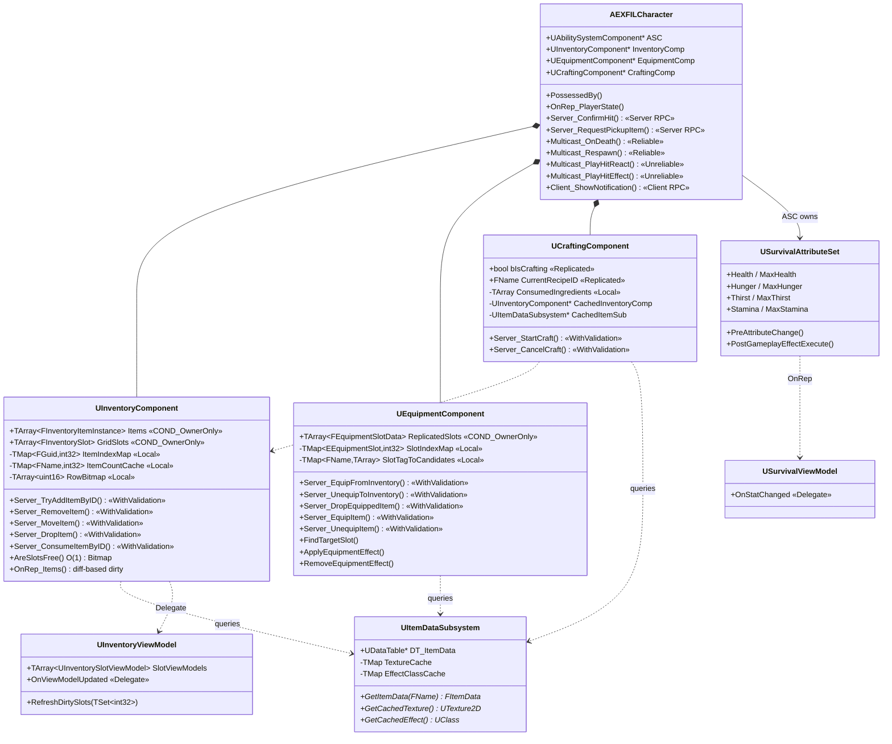
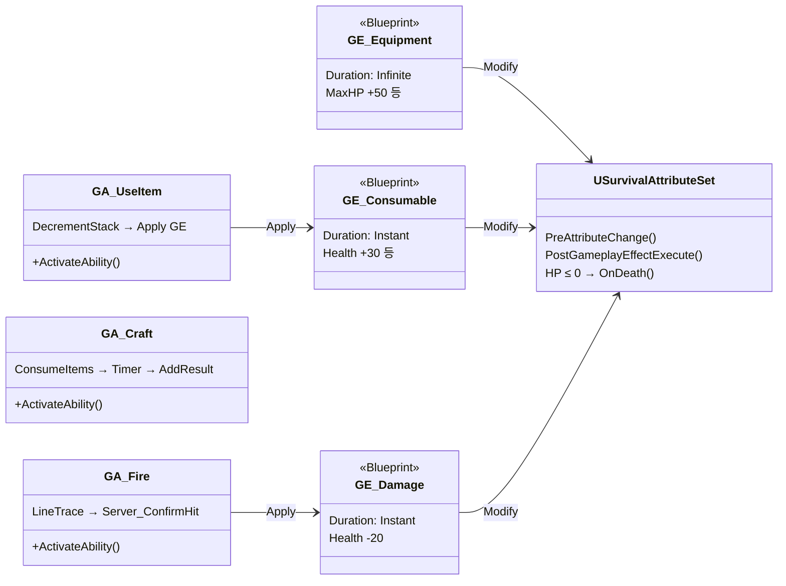
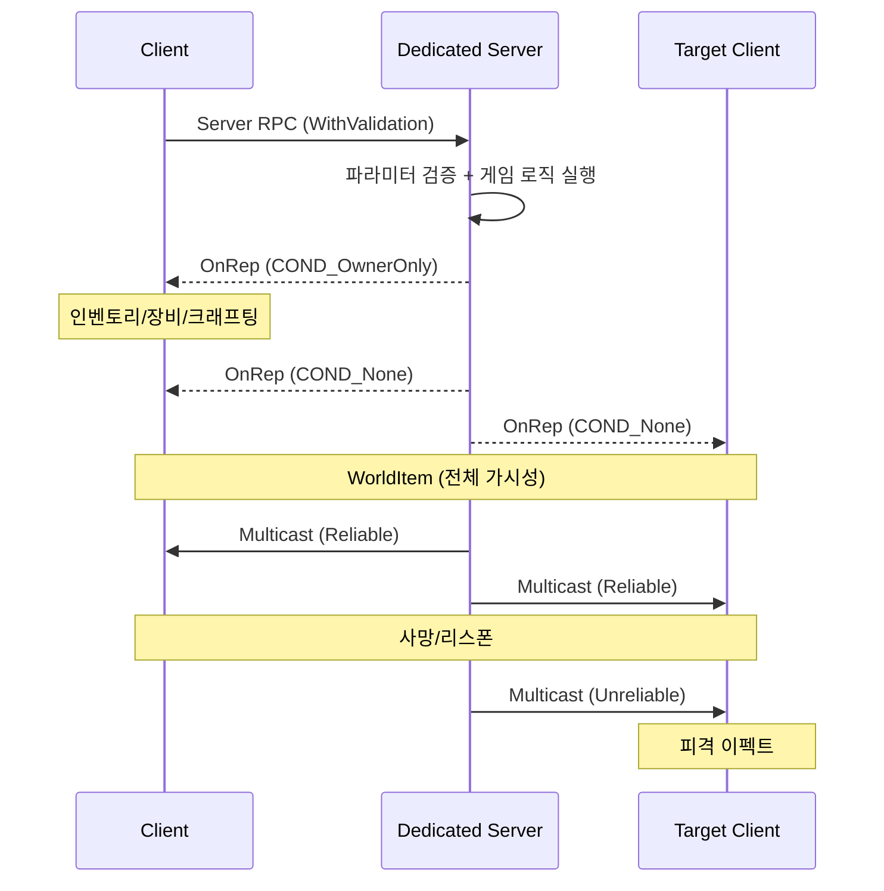

# Project EXFIL

**UE5 C++ Dedicated Server 기반 서바이벌 시스템 프로토타입**

타르코프 스타일 그리드 인벤토리, GAS 통합 전투, 크래프팅 시스템을 UE5.6 C++ Dedicated Server 아키텍처로 구현한 멀티플레이어 프로토타입.

---

## 🎬 시연 영상

[](https://youtu.be/OF0snQA3hdw?si=EU7B3wh0OLt1pxQ9)

---

## 📌 개요

| | |
|---|---|
| **엔진** | Unreal Engine 5.6 |
| **언어** | C++ (100%) |
| **아키텍처** | Dedicated Server, Server Authority |
| **개발 기간** | 2026.3.18 - 2026.3.29 |
| **작업 인원** | 1명 |

---

## 📁 프로젝트 구조

```
Source/Project_EXFIL/
├── Core/           캐릭터, 게임모드, 로그 (5개)
├── Inventory/      그리드 인벤토리, ViewModel (6개)
├── GAS/            AttributeSet, GA, GE, ViewModel (8개)
├── Equipment/      장비 6슬롯, GE Apply/Remove (4개)
├── Crafting/       레시피 검증, 타이머 제작 (2개)
├── UI/             위젯, 드래그&드롭, 컨텍스트 메뉴 (12개)
├── World/          WorldItem 픽업/드롭 (2개)
└── Data/           DataTable 서브시스템 (3개)
```

---

## 📊 기술 스택

| 분류 | 기술 |
|------|------|
| 엔진 | UE 5.6 |
| 언어 | C++ |
| GAS | AttributeSet, GameplayAbility, GameplayEffect |
| 네트워크 | Dedicated Server, Server RPC, OnRep, Multicast |
| UI | Common UI, MVVM, Slate NativePaint |
| 데이터 | UDataTable, CSV, UItemDataSubsystem |

---

## 🎯 핵심 시스템

| 시스템 | 설명 |
|--------|------|
| **Grid Inventory** | 다중 크기 아이템 배치, 회전, 드래그앤드롭, 스택 |
| **Crafting** | DataTable 기반 레시피, GameplayAbility로 제작 실행 |
| **Equipment** | 장비 슬롯 관리, GameplayEffect로 스탯 보너스 적용/해제 |
| **Survival Stats** | GAS AttributeSet (Health, Hunger, Thirst, Stamina) |
| **Line Trace Shooting** | LocalPredicted GA, 서버 라인 트레이스 재검증 |
| **Replication** | 서버 권한 모델, RPC 기반 동기화, COND 전략 분리 |


---

## 🏗️ 아키텍처

```
View Layer (CommonUI Widgets)
    │  Delegate
ViewModel Layer (데이터 변환)
    │  Delegate
Model Layer (UInventoryComponent, UCraftingComponent, UEquipmentComponent)
    │
GAS Layer (USurvivalAttributeSet, GameplayEffects, GameplayAbilities)
    │
Data Layer (UDataTable + CSV)
    │
Network Layer (Replication + Server RPC + COND_OwnerOnly/None)
```

### 설계 원칙

- **MVVM 단방향:** View → ViewModel → Model 방향으로만 참조. 게임플레이 상태 동기화는 Delegate/OnRep 기반 (Tick-free)
- **Server Authority:** 모든 게임 로직은 서버에서만 실행
- **Data-Driven:** 아이템/레시피/장비 스펙 전부 DataTable CSV — 코드 변경 없이 콘텐츠 확장 가능

---

## ✨ 핵심 기능 상세

### FEATURE 01 — 그리드 인벤토리 공간 할당 + 탐색 최적화
- 1D `TArray`로 2D 그리드를 표현하는 타르코프 스타일 인벤토리 — 멀티셀 아이템(최대 2×3) 배치, 회전, 스택 병합
- **Bitmap** 비트 AND 연산으로 빈 영역 검증: **O(1)**
- `ItemIndexMap` (`TMap<FGuid, int32>`)으로 아이템 탐색: **O(N) → O(1)**
- Replicated State(`Items` + `GridSlots`) + 로컬 전용 캐시(`TMap`/`Bitmap`) 분리 설계
- Dirty Flag로 서버/클라이언트 양쪽 경로에서 변경분만 ViewModel → IconOverlay까지 전파

### FEATURE 02 — 서버 히트 재검증 슈팅
- `GA_Fire`(LocalPredicted) → 클라이언트 즉시 발사
- `Server_ConfirmHit`(Reliable, WithValidation) → 서버에서 동일 라인 트레이스 재실행
- 검증 통과 시 GAS 파이프라인으로 `GE_Damage`를 타겟 ASC에 적용
- 피격: Overlay Material 플래시(Unreliable) / 사망: 래그돌 → 3.5초 후 리스폰(Reliable)

### FEATURE 03 — GAS 통합 파이프라인
- 소비·장비·전투·크래프팅 4개 시스템 → 단일 `AttributeSet` + `PostExecute`로 합류
- GA 3종(`UseItem` / `Craft` / `Fire`) + GE 3종(`Consumable` / `Equipment` / `Damage`)
- ASC Mixed Replication: GE → Owner에게만, GameplayCue → 전체 클라이언트에 전파

### FEATURE 04 — Dedicated Server 리플리케이션
- Server Authority 모델 — 클라이언트는 Server RPC로 요청만 전달
- **Server RPC 14개 전수 WithValidation** 적용
- 리플리케이션 조건 전략 분리: `COND_OwnerOnly`(인벤토리/장비/크래프팅) vs `COND_None`(WorldItem)
- 치트 방어 3계층: WithValidation → 서버 라인 트레이스 재검증 → HasAuthority 가드

---

## 📐 클래스 구조





---

## 🔄 네트워크 흐름



---

## 🔧 빌드 및 실행

### 요구사항
- Unreal Engine 5.6
- Visual Studio 2022 또는 Rider
- Windows 11

### 설정
```bash
git clone https://github.com/agnesAqr/project_EXFIL.git
```
1. `Project_EXFIL.uproject`를 UE5.6으로 열기
2. Development Editor로 빌드
3. PIE → 2 Players → Dedicated Server로 실행

---

## 📄 다이어그램 (GitHub Pages)

인터랙티브 HTML 다이어그램:

- [슈팅 네트워크 흐름](docs/Portfolio/ShootingNetworkFlow.html)
- [GAS 통합 파이프라인](docs/Portfolio/GASPipeline.html)
- [리플리케이션 아키텍처](docs/Portfolio/ReplicationArch.html)
- [그리드 + Bitmap 시각화](docs/Portfolio/GridBitmapVisualization.html)
- [캐시 분리 아키텍처](docs/Portfolio/CacheSeparationArch.html)
- [ASC 타이밍 다이어그램](docs/Portfolio/ASCTimingDiagram.html)
- [최적화 비교표](docs/Portfolio/OptimizationTable.html)

---

## 📝 라이선스

본 프로젝트는 포트폴리오 목적으로 제작되었습니다.

---

*UE5 C++ · Dedicated Server · GAS · MVVM*
